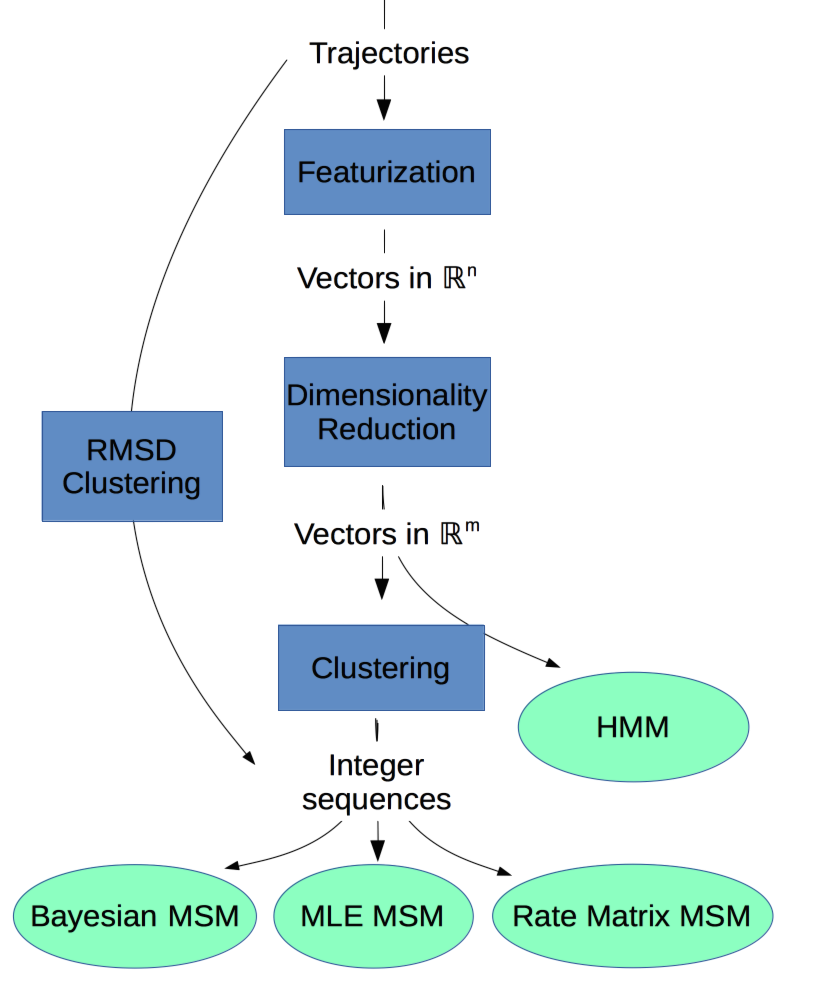

.. _background:

Motivation
==========

The aim of this package is to provide software tools for predictive
modeling of the long timescale dynamics of biomolecular systems using
statistical modeling to analyze physical simulations.

Given a dataset of one or more stochastic trajectories tracking the
coordinates of every (10,000+) atom in a molecular system at a discrete
time interval, how do we understand the slow dynamical processes and make
quantitative predictions about the system?

Workflow
--------

To build a dynamical model, we apply (stepwise) a series of dimensionality
reductions. The basic set of steps is outlined below. Note that most steps
are optional under certain circumstances. The particulars should become
clear as you continue reading the documentation.

1. Set up a system for molecular dynamics, and run one or more simulations
   for as long as you can on as many CPUs or GPUs as you have access.
   There are a lot of great software packages for running MD, e.g `OpenMM
   <https://simtk.org/home/openmm>`_, `Gromacs <http://www.gromacs.org/>`_,
   `Amber <http://ambermd.org/>`_, `CHARMM <http://www.charmm.org/>`_, and
   many others. MSMBuilder is not one of them.

2. :ref:`Featurize<featurization>` trajectories into an appropriate vector
   of features. The full :math:`3N` set of atomic coordinates is
   potentially unwieldy and redundant. It likely does not respect the
   rotational or translational symmetry of your system either. We commonly
   use backbone dihedral angles as our features, although this depends
   highly on the system being modeled.

3. :ref:`Decompose<decomposition>` your features into a new basis that
   preserves the relevant information in your data with fewer dimensions.
   We typically use tICA, which finds linear combinations of input degrees
   of freedom that maximize autocorrelation or "slowness".

4. :ref:`Cluster<cluster>` your data to define (micro-)states by grouping
   similar input data points. At this stage, we've reduced the
   dimensionality of the problem from potentially thousands of :math:`xyz`
   coordinates to a single cluster (state) index.

5. :ref:`Estimate a model<msm>` from the clustered data. We typically build
   an MSM, which models the important dynamics of the system.

6. Use :ref:`GMRQ cross-validation<gmrq>` to select the best model. There
   are many hyperparameters (knobs to tweak) in the workflow. This scoring
   function can help us pick the best values.

    A diagram of potential workflows.

.. vim: tw=75
