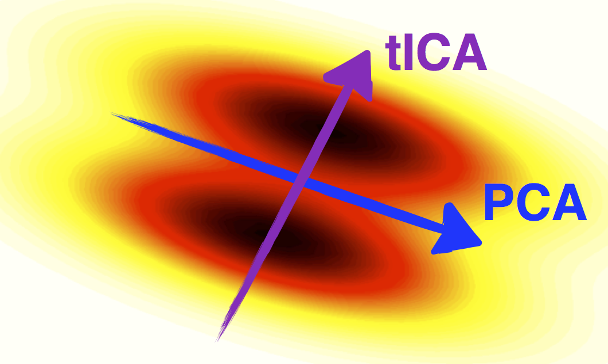

.. _decomposition:
.. currentmodule:: msmbuilder.decomposition

Decomposition
=============

tICA
----

   tICA compared to PCA (courtesy of C. R. Schwantes)

Time-structure independent components analysis (tICA) is a method for
finding the slowest-relaxing degrees of freedom in a time series data set
which can be formed from linear combinations from a set of input degrees of
freedom.

tICA can be used as a dimensionality reduction method, and in that capacity
it is somewhat similar to PCA.  However whereas PCA finds high-variance
linear combinations of the input degrees of freedom, tICA finds
high-autocorrelation linear combinations of the input degrees of freedom.

The tICA method has one obvious drawback: its solution is
a linear combination of all input degrees of freedom, and their
relative weights are typically non-zero. This makes each independent component
difficult to interpret in a algorithmic fashion, because
it could comprise hundreds or thousands of different metrics.
Because an important property of reaction coordinates is their
role in facilitating physical interpretation of the underlying molecular
system, we consider it desirable to reduce the number of
explicitly used variables. SparseTICA[#f2]_ attempts to resolve this
interpretability issue by using a sparse approximation to
the eigenvalue problem found in tICA and returning independent components
composed of only the most relevant degrees of freedom.

PCA
---

Principal component analysis (PCA) is a method for finding the most
highly-varying degrees of freedom in a data set (not necessarily a time
series). PCA is useful as a dimensionality reduction method.

Algorithms
----------

.. autosummary::
    :toctree: _decomposition/

    tICA
    SparseTICA
    PCA

Combination with MSM
--------------------

While the tICs are themselves approximations to the dominant eigenfunctions
of the propagator / transfer operator, the approach taken in [#f1]_ and
[#f2]_ is to "stack" tICA with :ref:`MSMs<msm>`. For example, in [#f2]_,
Perez-Hernandez et al.  first measured the 66 atom-atom distances between a
set of atoms in each frame of their MD trajectories, and then used tICA to
find the slowest 1, 4, and 10 linear combinations of these degrees of
freedom and transform the 66-dimensional dataset into a 1, 4, or
10-dimensional dataset. Then, they applied
:class:`~msmbuilder.cluster.KMeans` to the resulting data and built an MSM.

.. todo: Link to example notebook.

References
----------

.. [#f1] Schwantes, Christian R., and Vijay S. Pande. `Improvements in Markov State Model Construction Reveal Many Non-Native Interactions in the Folding of NTL9 <http://dx.doi.org/10.1021/ct300878a>`_ J. Chem Theory Comput. 9.4 (2013): 2000-2009.
.. [#f2] Perez-Hernandez, Guillermo, et al. `Identification of slow molecular order parameters for Markov model construction <http://dx.doi.org/10.1063/1.4811489>`_ J Chem. Phys (2013): 015102.
.. [#f3] Naritomi, Yusuke, and Sotaro Fuchigami. `Slow dynamics in protein fluctuations revealed by time-structure based independent component analysis: The case of domain motions <http://dx.doi.org/10.1063/1.3554380>`_ J. Chem. Phys. 134.6 (2011): 065101.
.. [#f4] McGibbon, R. T. & Pande, V. S. `Identification of simple reaction coordinates from complex dynamics <http://arxiv.org/abs/1602.08776>`_ ArXiv 16 (2016).

.. vim: tw=75
